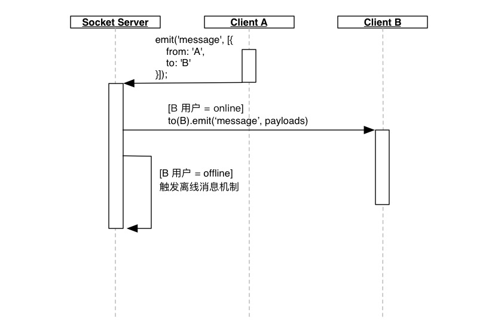

# im.js
>一个基于 react-native + mobx + socket.io + node 的仿微信 JS-Wechat。

## 示例

## 运行项目
> react-native 在 debug 和 release 模式之间的性能差距是惊人的。

安装依赖
```shell
npm install
```
进入开发模式
```shell
react-native run-ios
// or
react-native run-android
```

## im.js.server
> 基于 socket.io + koa2 + [cloverx](https://github.com/clover-x/cloverx)(自用 RestuFul 框架)

im 服务端项目地址：[im.js.server](https://github.com/plusmancn/im.js.server)

服务端用到了 [cloverx-doc](https://github.com/clover-x/cloverx-doc) 来生成 `Swagger` 在线调试文档，[cloverx-doc](https://github.com/clover-x/cloverx-doc) 还自带了一个输出格式化器，用来保证 `Api` 接口输出的一致性，纯手撸的，有兴趣可以看下。

## 组件库
> 开发本项目的时候，要求自己尽量手写基础组件，基础组件与业务无关，可通用

组件库地址：[UiLibrary](https://github.com/plusmancn/im.js/blob/master/UiLibrary/README.md)


## 组件调试
通过更改 `app.json` 的 `appMode` 字段，进行组件调试模式（`UiLibrary`）和 Im 模式（`ImClient`）的切换。  

## 开发笔记
> 详细记录了开发过程中的思考 [点击进入博客](https://github.com/plusmancn/plusmancn.github.com)  


## TODO

**计划中**  

- [x] 应用内离线消息，基于 `Reids` 实现。
- [ ] 当 `rn-0.43` 发布的时候，使用 `FlatList` 和 `SectionList` 替换 `ListView`
- [ ] `ListView` 替换完成后，进行群聊开发
- [ ] 公众号菜单以及对应后台 `Dashboard` 开发
- [ ] 服务器 https 化

**或许会做**  

- [ ] 集成微信登录
- [ ] 集成一个第三方推送服务

**Bug 列表**
- [ ] 会话列表，消息如果以 `\n` 结尾，会造成多行问题。


# 技术文档
> 应用层消息事件和数据格式约定

## Paylaod
### 基础定义
```javascript
{
    from: String('用户ID'),
    to: String('用户ID'),
    uuid: String('消息唯一UUID'),
    // 用于存储消息内容
    msg: {
        ......
    },
    ext: {
        avatar: String('用户头像地址'),
        name: String('用户姓名'),
        // 可使用 moment().startOf('minute').fromNow() 格式化
        timestamp: timestamp(毫秒),
    },
    // 不参与网络传输，本地传递拓展字段位置
    localeExt: {
        ......
    }
}
```
### msg 字段定义
对象必须包含如下字段

字段 | 定义     | 可选值
:----|:---------|:-------------
type | 消息类型 | `txt`

**消息类型**  
```javascript
// txt - 文本类型消息
{
    type: 'txt',
    content: '文本内容',
}
```

### ext 字段定义
对象必须包含如下字段

字段 | 定义     | 可选值
:----|:---------|:-------------
timestamp | 消息创建时间 | UnixTimestamp(毫秒)

### 群聊与私聊
在消息传递层面，群聊和私聊共用一套事件机制，对于客户端来说，都是收到了某个用户的消息。

服务器层面，一个群的定义是 “业务逻辑圈定的一群用户”，当一个 `payload` 的投递对象是一个群时，
服务器需要向这个群内的所有有效用户，发送 `message` 事件。

群聊的优化点在于，如何保证一个群内的用户尽可能多的在一个 `socket` 节点上，以此来降低 `socket` 节点间通讯的开销。

## 消息事件
### Event: `message`
* `payloads: Array<Paylaod>` - Payload 数组，新消息在数组尾部

客户端之间无法直接发送消息，需要由 `socket` 服务器转发。  
客户端和服务端建立 `socket` 连接后，每个 `emit`, `on` 的对象都是远端，而非本地端。   
客户端的所有 `im` 消息，都将通过监听 `message` 事件来接收。  

**交互时序如下：**  


### Event: `disconnect`
发生在服务器和客户端之间的 `socket` 连接断开时。  

这个事件将更改用户状态为 `offline`。

### Event: `connection`
* `socket` - socket 连接对象

发生在服务器和客户端之间的 `socket` 连接建立、重连成功时。

### Event: `user:online`
* `data: Object` - 业务数据

当客户端存在登录用户信息且 `socket` 处于连接状态时，客户端向服务器发送用户上线事件。

在 `im.js` 设计中，`data` 中存放了如下信息，这个事件将更改用户的状态为 `online`
```javascript
{
    userId: String('用户ID')
}
```

## 用户状态裁决
[AppState](http://facebook.github.io/react-native/docs/appstate.html) 状态与 socket、用户在线状态关系。

State          | background | inactive | active
:--------------|:-----------|:---------|:-------
socket-ios     | close      | close    | connect
socket-android | close      | \        | connect
user-status    | offline    | offline  | online

## 离线消息机制
当用户状态为 `offline` 时候，触发离线消息机制。

[im.js.server](https://github.com/plusmancn/im.js.server) 的实现基于 `Redis`，单用户离线队列命名规则为 `offline:queue:userId:${userId}`，存储结构为 `Lists`。

当用户上线时候，客户端向服务器发送 `user:online` 事件，服务器以数组的形式返回对应用户的离线消息，并清空离线缓存。

## ACK 处理
